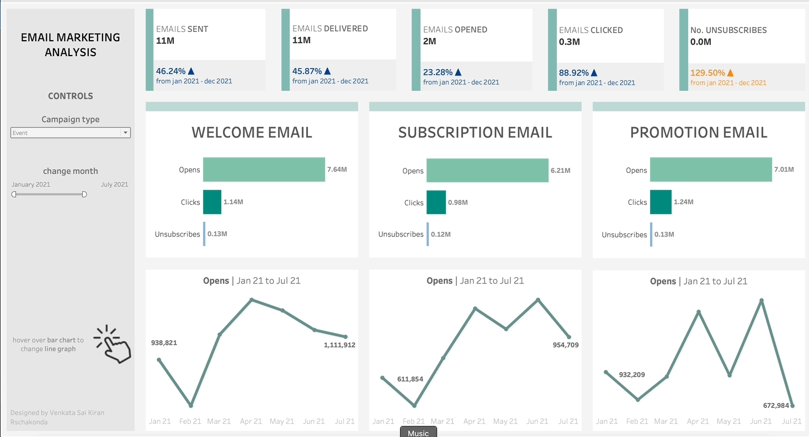

# Email Marketing Analysis Dashboard - Tableau

## Overview
This Tableau dashboard provides a comprehensive analysis of various types of marketing emails, such as Welcome Emails, Subscription Emails, and Promotional Emails. It focuses on interactive visualization of key metrics like open counts, click counts, and unsubscribe counts.

## Features
- **Interactive Hover Views:** Displays open counts, click counts, and unsubscribe counts for different categories of emails.
- **Email Category Analysis:** Breakdown of Welcome Emails, Subscription Emails, and Promotional Emails.
- **Event Tracking:** Tracks all events related to each email type.
- **User Engagement Metrics:** Provides insights into audience engagement with each email type.

## Dashboard Preview

## Getting Started
### Prerequisites
- Tableau Desktop or Tableau Public.
- Access to email marketing campaign data.

### Installation and Usage
1. Clone or download this repository.
2. Open the `Email_Marketing_Analysis.twb` file in Tableau.
3. Connect to your email campaign data.
4. Navigate through the dashboard to explore different email types and their performance metrics.

## Developed by
This dashboard was developed by Venkata Rachakonda, leveraging extensive expertise in data visualization and email marketing analytics.

## Contributing
Contributions are welcome. Feel free to fork this repository and propose enhancements through pull requests.
